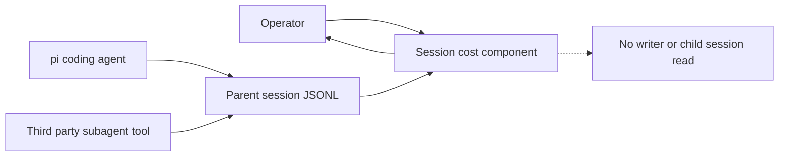

# 3. Context and Scope

## Business context

An operator drives pi and `openspec` through this repository's guards, role definitions, recipes, and
local deterministic tools. For cost reporting, the operator supplies an existing parent-session
`JSONL` file; session-cost reads it and emits text or an HTML fragment to standard output
(`tools/session-cost.ts:459`, `tools/session-cost.ts:462`).

## External actors and systems

| External entity | Relationship and interface | Ownership boundary |
| --- | --- | --- |
| Operator | Selects a session file and invokes `just session-cost <session> [--html]`. | Owns file selection and interpretation of incomplete coverage (`justfile.opsx:469`). |
| pi coding agent | Hosts extension execution and persists assistant messages in session `JSONL`. | Runtime and persistence format are outside this repository. |
| `@mjakl/pi-subagent` | Provides the `subagent` tool and persists aggregate child results in the parent tool-result details consumed by the rollup. | Third-party producer; this repository validates but does not modify its output (`install.sh:33`, `tools/session-cost.ts:286`). |
| `openspec` | Supplies change artifacts consumed by the delegated workflow. | External methodology with a repository-owned schema (`openspec/schemas/dev-reviewer/schema.yaml:1`). |
| Model providers | Execute main and child model calls whose already-calculated costs appear in persisted usage. | Pricing and usage production remain provider/runtime concerns; session-cost does not derive cost from tokens (`tools/session-cost.ts:147`). |

## Scope and coverage boundary

In scope are all eligible cost-bearing entries in the selected `JSONL` file: validated assistant
usage and validated aggregate child usage in processed, deduplicated parent `subagent` tool
results (`tools/session-cost.ts:269`, `tools/session-cost.ts:281`, `tools/session-cost.ts:286`). The
rollup does not filter to a currently visible branch; it processes the file in line order
(`tools/session-cost.ts:269`).

Out of scope are child-session retention, a new persistence hook, changes to the third-party
subagent extension, historical backfill, and modification of pi's built-in export. The shipped
command only reads the selected file and writes its rendering to standard output
(`tools/session-cost.ts:459`, `tools/session-cost.ts:462`).

## Optional Structurizr external interfaces

When the option is installed the system gains two external relationships and no new inbound one.
The Docker registry supplies the pinned image by digest, and the local Docker engine executes it in
a fresh container with no network (`tools/structurizr-docker.ts:96`). The team owns the model file;
the kit never authors it (`install.sh:218`). The accepted cost is that the render boundary depends
on an external registry being reachable the first time an engine pulls the image.
