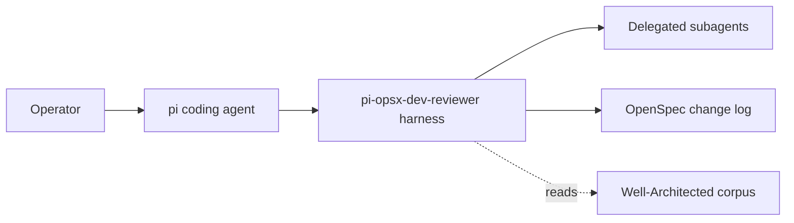

# 3. Context and Scope

## Business context

The kit sits between an operator and the pi coding agent. The operator drives a change; the
kit constrains how pi executes it, so that a single read-only main agent orchestrates
specialist subagents under structural guards.

## External actors and systems

| External entity | Relationship | Interface |
| --- | --- | --- |
| **pi coding agent** | Host runtime the kit extends | Extensions loaded from `.pi/extensions/`, agents from `~/.pi/agent/agents/`, prompts from the prompts directory (`install.sh:35`, `install.sh:44`). |
| **`@mjakl/pi-subagent`** | Community extension that adds the `subagent` tool and sets identity | Installed by `install.sh:33`; provides `PI_SUBAGENT_STACK` / `PI_SUBAGENT_DEPTH`. |
| **OpenSpec 1.4.1** | Change-management CLI | The `dev-reviewer` schema and `just` recipes wrap it (`justfile.opsx:63`). |
| **aws-well-architected-review skill** | Third-party corpus + Python lookup helper | Invoked read-only as a subprocess by `tools/waf-grounding.ts` for architecture-writer grounding. |
| **Model providers** | Back the agents | Each agent pins a `model:` (`agents/developer.md:4`, `agents/reviewer.md:4`); cross-family by design (see section 9). |

## Scope

In scope: the delegation guards, the agent role definitions, the OpenSpec `dev-reviewer`
schema and its gates, the learning/trust/goal ledgers, and the deterministic engines under
`tools/`.

Out of scope: the pi runtime itself, the model providers, and the third-party corpus — the
kit consumes these but does not own them.

## System context

