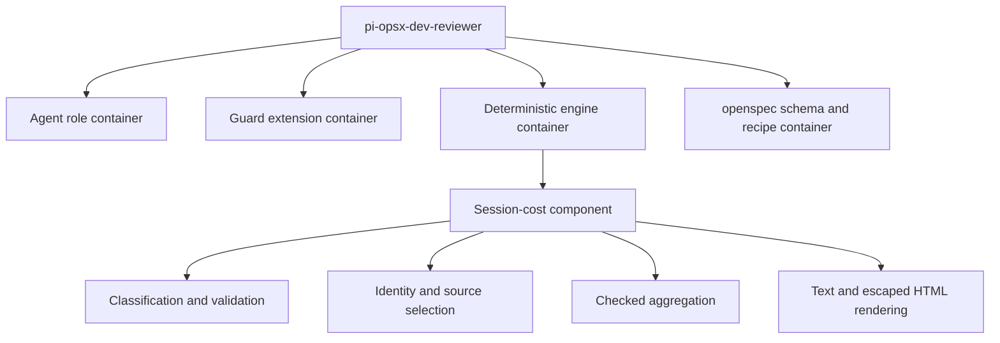
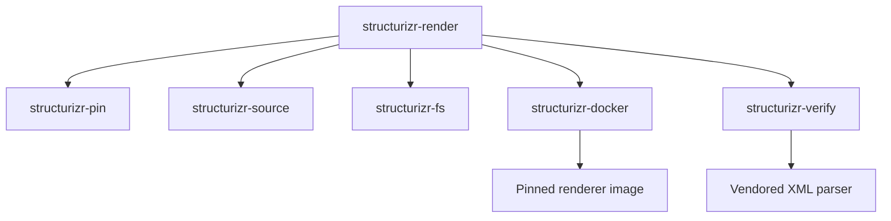

# 5. Building Block View

Detail stops at container and component levels; this view does not mirror classes or helper
functions.

## Level 1—containers

The installed system comprises the agent role set, runtime guard extensions, deterministic local
engines, and the `openspec` schema plus `just` recipes (`install.sh:69`, `install.sh:74`,
`openspec/schemas/dev-reviewer/schema.yaml:80`). Seven agent definitions divide design,
implementation, review, architecture, evolution, and reader-documentation responsibilities
(`agents/architecture-writer.md:2`, `agents/evolution-narrator.md:2`, `agents/tech-writer.md:2`).

## Level 2—session-cost component

Session-cost belongs to the deterministic-engine container and has four component-level
responsibilities:

1. **Input classification and normalization** accepts only eligible assistant and parent
   `subagent` tool-result records, then validates cost and token fields
   (`tools/session-cost.ts:133`, `tools/session-cost.ts:147`, `tools/session-cost.ts:281`).
2. **Identity and source selection** deduplicates native calls by trimmed persisted ID, collects
   top-level legacy annotations independently, and selects native or fallback replay session-wide
   (`tools/session-cost.ts:293`, `tools/session-cost.ts:315`, `tools/session-cost.ts:327`).
3. **Checked aggregation** updates model rows, persisted subagent subtotal, and grand total only
   when every impacted sum remains finite (`tools/session-cost.ts:161`,
   `tools/session-cost.ts:197`, `tools/session-cost.ts:214`).
4. **Rendering** consumes one coverage-reason representation for text and HTML and escapes dynamic
   HTML strings (`tools/session-cost.ts:343`, `tools/session-cost.ts:370`,
   `tools/session-cost.ts:391`).

The component reads existing persisted aggregates and writes no session data
(`tools/session-cost.ts:10`, `tools/session-cost.ts:459`). Avoiding a writer and additional
package keeps the component deployable by file copy, but accepts dependence on whatever aggregate
detail the parent session retained.

## Level 2—optional Structurizr components

Six deterministic components divide the render path, each with one responsibility:

1. **Pin** loads a closed schema and rejects mutable, retired, or drifting references before Docker
   is queried (`tools/structurizr-pin.ts:200`).
2. **Source** accepts exactly one repository-contained regular model file and scans out prohibited
   directives and workspace extension (`tools/structurizr-source.ts:196`).
3. **Filesystem** owns the lock, the nonce-bound staging directory, and atomic publication
   (`tools/structurizr-fs.ts:263`).
4. **Docker** runs the four pinned command vectors in fresh, hardened containers with exact generated names
   (`tools/structurizr-docker.ts:236`).
5. **Verify** proves JSON shape, lineage, view keys, passive-SVG safety, and manifest provenance
   (`tools/structurizr-verify.ts:797`).
6. **Render** composes them behind one frozen error precedence
   (`tools/structurizr-render.ts:41`).

The accepted cost of this split is six files and six test suites rather than one script; the
benefit is that each boundary is independently testable without Docker.

