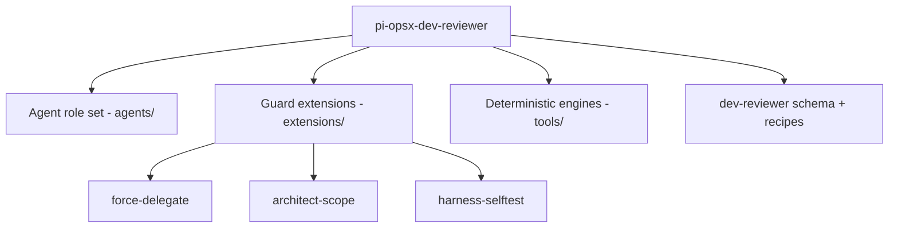

# 5. Building Block View

Detail stops at the container and component level; source structure is not mirrored here.

## Level 1 — system context

The kit is one system installed into a host repository. It comprises four containers: the
**agent role set** (`agents/`), the **guard extensions** (`extensions/`), the
**deterministic engines** (`tools/`), and the **OpenSpec dev-reviewer schema and recipes**
(`openspec/schemas/dev-reviewer/`, `justfile.opsx`).

## Level 2 — containers

### Agent role set (`agents/`)

Six single-file agent definitions, each with `name`, `model`, and `tools` frontmatter:
`architecture-writer` (`agents/architecture-writer.md:2`), `developer`
(`agents/developer.md:2`), `reviewer` (`agents/reviewer.md:2`), `solution-architect`
(`agents/solution-architect.md:2`), `spec-reviewer` (`agents/spec-reviewer.md:2`), and
`tech-writer` (`agents/tech-writer.md:2`). Write-capable agents carry
`tools: read,grep,find,ls,edit,write,bash`; the two review roles drop `edit`/`write`/`bash`
(`agents/reviewer.md:6`, `agents/spec-reviewer.md:6`).

### Guard extensions (`extensions/`)

- **force-delegate** — makes the main agent read-only and no-ops inside subagents
  (`extensions/force-delegate/index.ts:15`).
- **architect-scope** — per-agent write-path policy, fail-closed
  (`extensions/architect-scope/index.ts:45`).
- **harness-selftest** — session-start canary that halts if force-delegate did not load
  (`extensions/harness-selftest/index.ts:28`).
- **developer-guard** — blocks catastrophic bash on write-capable subagents
  (`extensions/developer-guard/index.ts:23`).
- **branch-guard** — blocks commit/push/force-push to protected branches
  (`extensions/branch-guard/index.ts:7`).
- **lib/tool-events.ts** — shared append of every blocked call to a JSONL audit trail.

### Deterministic engines (`tools/`)

TypeScript engines run by bun: `arch-lint.ts` (the architecture gate, 1015 lines),
`waf-grounding.ts` (corpus resolution, 816 lines), `pylib.ts` (CPython-semantics helpers
shared by the two), plus `select-learnings.ts`, `audit-learnings.ts`, `trust.ts`,
`verify-goals.ts`, `session-cost.ts`, and `assess-tool-events.ts`.

### OpenSpec dev-reviewer schema and recipes

The `dev-reviewer` schema declares eight artifacts including `review-report`
(`openspec/schemas/dev-reviewer/schema.yaml:68`), `architecture`
(`openspec/schemas/dev-reviewer/schema.yaml:80`), and `docs`
(`openspec/schemas/dev-reviewer/schema.yaml:99`), and bakes delegation into the apply step
(`openspec/schemas/dev-reviewer/schema.yaml:119`). The `justfile.opsx` recipe suite provides
the gates: `docs-lint:7`, `arch-lint:44`, `archive-check:63`, `check-extensions:245`,
`verify-gate:285`.

## Container diagram

