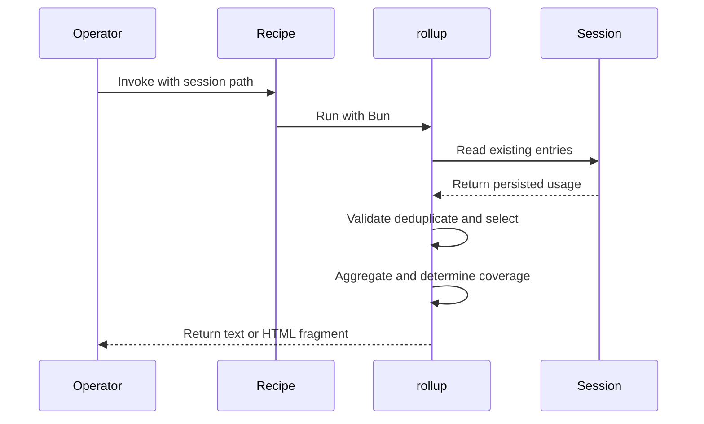
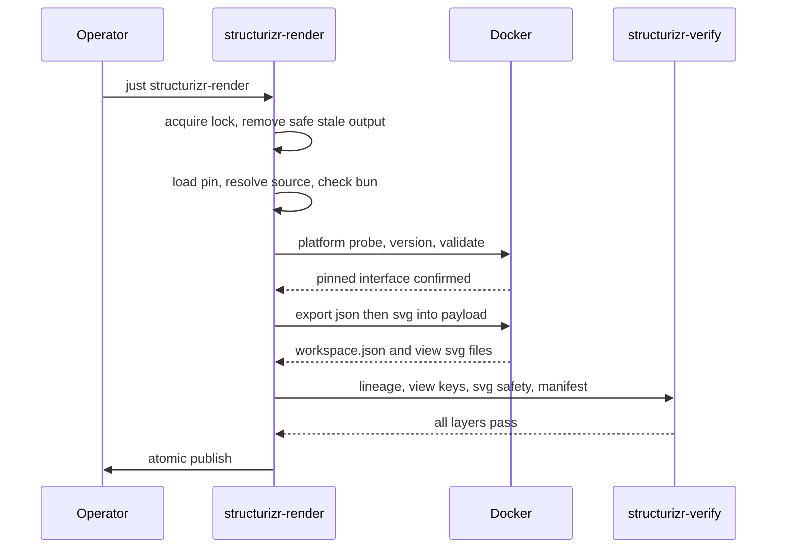

# 6. Runtime View

## Scenario 1—roll up a parent session

1. The operator invokes the recipe with a selected parent-session `JSONL` path; Bun runs
   `tools/session-cost.ts` (`justfile.opsx:470`).
2. The command reads the file and processes parseable JSON objects in stable line order
   (`tools/session-cost.ts:269`, `tools/session-cost.ts:459`). Blank, malformed JSON, and
   non-object lines do not become accounting candidates (`tools/session-cost.ts:270`).
3. Eligible assistant messages are normalized as main usage. Eligible `subagent` tool results are
   counted, deduplicated by trimmed entry ID, and each child in `message.details.results[]` is
   normalized independently (`tools/session-cost.ts:281`, `tools/session-cost.ts:286`,
   `tools/session-cost.ts:293`, `tools/session-cost.ts:306`).
4. Top-level `subagentCost` is collected independently as a legacy candidate, including on a line
   whose native candidate was rejected as a duplicate (`tools/session-cost.ts:315`).
5. Native replay runs first. At least one aggregate-safe accepted child makes native details
   authoritative for the file; otherwise legacy replay supplies fallback values
   (`tools/session-cost.ts:325`, `tools/session-cost.ts:327`, `tools/session-cost.ts:331`).
6. The result returns model rows, accepted grand total, selected persisted-subagent subtotal, call
   counts, and complete or incomplete coverage from the ordered positive diagnostic counts
   (`tools/session-cost.ts:343`, `tools/session-cost.ts:349`).
7. Text or escaped HTML is written to standard output; incomplete output states that the accepted
   total is partial (`tools/session-cost.ts:386`, `tools/session-cost.ts:417`,
   `tools/session-cost.ts:462`).

## Scenario 2—malformed or ambiguous persisted usage

A malformed eligible value is excluded without suppressing independent valid values. Duplicate or
ID-less native calls, malformed containers or children, fallback selection, ignored legacy values,
and aggregate overflow each contribute to the canonical reason list
(`tools/session-cost.ts:63`, `tools/session-cost.ts:281`, `tools/session-cost.ts:297`). The command
still exits normally for a readable file and labels the accepted total partial
(`tools/session-cost.ts:359`, `tools/session-cost.ts:386`). The accepted trade-off is availability
of defensible partial accounting rather than all-or-nothing reporting.

## Scenario 3—unreadable input

If the selected file cannot be read, the CLI writes an error and exits non-zero
(`tools/session-cost.ts:458`, `tools/session-cost.ts:465`). This separates transport failure from
record-level coverage defects.

## Optional Structurizr render sequence

A render establishes safe paths, takes the lock, then validates configuration before touching
Docker, so a contended lock is reported ahead of a malformed pin
(`tools/structurizr-render.ts:129`). Nothing is published until every verification layer passes, and
a failed run leaves the final root absent rather than stale (`tools/structurizr-render.ts:216`). The
accepted cost is that a previous good render is discarded early in a run that later fails.

