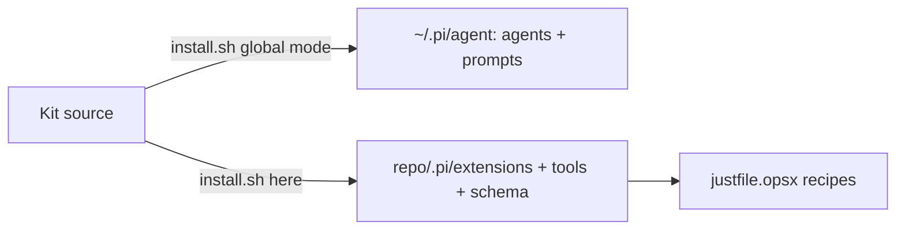

# 7. Deployment View

There is no server and no hosted environment. The kit is a set of files copied into two
locations on an operator's machine.

## Topology

| Target | Contents | Evidence |
| --- | --- | --- |
| `~/.pi/agent/agents/` and the prompts directory (global) | Six agent files and five prompt templates | `install.sh:35`, `install.sh:44` |
| `<repo>/.pi/extensions/` (per repository) | All guard extensions | `install.sh:66` |
| `<repo>/tools/` | The deterministic engines | `install.sh:71` |
| `<repo>/openspec/schemas/dev-reviewer/` | The custom schema (only if the repo has no other schema) | `install.sh:77` region |
| `<repo>/justfile.opsx` + import | The recipe suite | Appended to the host justfile without overwrite |

## Install modes

`install.sh` supports `--here` (project pieces into a repo), no-argument global install, and
`--all` (`install.sh:5`, `install.sh:8`). The global path also installs
`@mjakl/pi-subagent` and runs a model sanity check (`install.sh:33`, `install.sh:51`).

## Operations

Runtime state — the trust ledger, goal ledger, and tool-events audit — is generated under
`memory/` and is gitignored, never committed. Guard load-health is verified in place at
install time via `just check-extensions` (`justfile.opsx:245`).

## Deployment topology

