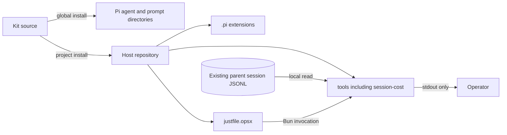

# 7. Deployment View

A no server or session-cost daemon. The installation script copies repository-scoped
extensions and deterministic tools into an operator-selected repository
(`install.sh:62`, `install.sh:69`, `install.sh:74`). Session-cost is one copied TypeScript file and
is invoked through Bun by a `just` recipe (`install.sh:75`, `justfile.opsx:470`).

## Topology

| Node | Deployed artifact | Runtime relationship | Accepted cost |
| --- | --- | --- | --- |
| Pi global agent directory | Role definitions and prompts | Pi launches isolated role processes (`install.sh:35`, `install.sh:44`). | Global installation must be maintained on each operator machine. |
| Host repository `.pi/extensions/` | Guard extensions | Pi loads policy at session startup (`install.sh:69`). | Each repository receives copied files rather than a central update service. |
| Host repository `tools/` | Session-cost and other deterministic engines | Bun reads local session files and writes reports to stdout (`install.sh:74`, `tools/session-cost.ts:459`). | Operators must provide Bun and access to the selected `JSONL` file. |
| Host repository recipe file | `session-cost` and quality gates | `just` dispatches local tools (`justfile.opsx:470`). | The feature is separate from pi's built-in HTML exporter. |

No additional service, datastore, session writer, or third-party package is deployed for persisted
subagent accounting: the existing parent-session details are the input boundary and the tool imports
only the Node filesystem reader (`tools/session-cost.ts:10`, `tools/session-cost.ts:286`). The
accepted cost is no recovery of data that the parent file did not persist.

## Optional Structurizr deployment

The render boundary is a container, not a service. Each pinned command runs in a fresh container
with no network, all capabilities dropped, no new privileges, the host `UID:GID`, a read-only
single-file model mount, and a writable payload mount only
(`tools/structurizr-docker.ts:96`). The Docker socket, repository root, model parent, home
directory, and credential directories are never mounted (`tools/structurizr-docker.ts:76`). The
accepted cost is one container process per command rather than a reused container.

In CI the canonical target is a native `linux/amd64` `ubuntu-24.04` runner with only
`contents: read`, pinned actions, and a render subprocess started from an empty environment
carrying exactly six named non-secret variables
(`templates/structurizr/structurizr.yml:104`). Verified output is uploaded for 14 days and never
committed. The accepted cost is that the enforceable claim covers the subprocess and container
boundaries, not the whole runner job.
