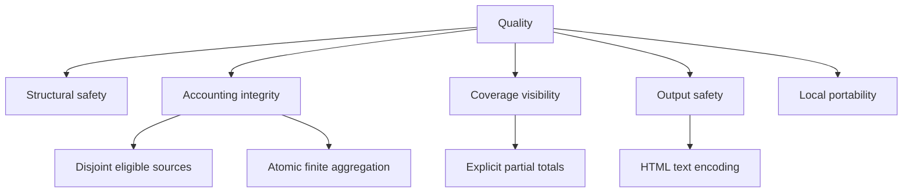

# 10. Quality Requirements

## Quality tree

## Quality scenarios

| Attribute | Scenario | Repository evidence | Accepted cost |
| --- | --- | --- | --- |
| Structural safety | The main agent attempts a direct write and must delegate instead. | `extensions/force-delegate/index.ts:6` | Every write pays delegation latency. |
| Accounting integrity | Assistant usage and persisted native child aggregates contribute exactly once without request/result or native/legacy inflation. | `tools/session-cost.test.ts:73`, `tools/session-cost.test.ts:87`, `tools/session-cost.test.ts:190` | In a hybrid file, valid legacy annotations are excluded when native authority exists. |
| Numeric reliableness | One aggregate-overflowing value changes no impacted accumulator and later independent values remain usable. | `tools/session-cost.ts:161`, `tools/session-cost.test.ts:218` | The displayed accepted total can be partial rather than coerced or non-finite. |
| Coverage visibility | Text and HTML present the same positive reason counts in canonical order and label any such result incomplete. | `tools/session-cost.ts:343`, `tools/session-cost.test.ts:266` | The renderer contract includes a stable reason taxonomy that future changes must preserve. |
| Compatibility | Legacy-only annotations remain reportable without inventing child calls or tokens. | `tools/session-cost.test.ts:171` | Legacy fallback is always marked incomplete because child correlation is unavailable. |
| Output safety | A hostile filename, model, coverage label, or reason cannot create HTML markup. | `tools/session-cost.ts:391`, `tools/session-cost.test.ts:300` | Every future dynamic HTML insertion must use the shared encoder. |
| Portability | Project installation copies the session-cost engine and invokes it with the existing Bun toolchain. | `install.sh:74`, `justfile.opsx:470` | No managed service fills persistence gaps or performs historical backfill. |

## Coverage claim boundary

`complete` means the closed reason list is empty, not that independent child sessions or provider
billing were reconciled. `incomplete` means the reported grand total is the accepted persisted
subset and rejected or ambiguous cost is not treated as zero (`tools/session-cost.ts:359`,
`tools/session-cost.ts:386`). A file with no processed subagent calls and no detected cost defects
can therefore be complete, while fallback, duplicate, ID-less, malformed, ignored, unusable, or
overflowing candidates make coverage incomplete (`tools/session-cost.ts:63`,
`tools/session-cost.ts:343`).

## AWS Well-Architected assessment

Not applicable—this repository deploys no AWS workload; it is a local file-copy toolchain
(`install.sh:62`, `install.sh:69`). The shipped grounding engine consumes a pinned 306-practice
corpus for documenting consumer workloads (`tools/waf-grounding.ts:2`), but this architecture makes
no AWS Well-Architected met or unmet claim about the repository itself.

## Optional Structurizr quality requirements

| Quality | Scenario | Evidence that it holds |
| --- | --- | --- |
| Safety | A renderer emits an SVG carrying a script, an event handler, or an external reference. | The gate rejects it and publishes nothing; 29 rejection fixtures cover scripts, events, foreign namespace content, every external URL form, CSS obfuscation, document type declarations, and entities (`tools/fixtures/structurizr/svg-safety/rejected/`). |
| Integrity | A published file is altered after the render. | The manifest records size and SHA-256 per file, and re-verification fails on any drift (`tools/structurizr-verify.ts:742`). |
| Isolation | A render attempts to reach the network or the host. | Containers run with `--network=none` and no credential mount (`tools/structurizr-docker.ts:96`). |
| Determinism | The same tree is serialized twice. | Manifest serialization is byte-identical; SVG bytes are explicitly not, and no byte-equality assertion exists (`tools/structurizr-verify.ts:14`). |
| Non-regression | The option is installed into a repository using Mermaid. | Mermaid lint output is identical before and after installation (`tools/structurizr-guidance.test.ts:136`). |

The accepted cost across all five is a slower, Docker-dependent gate than a text diagram needs.
